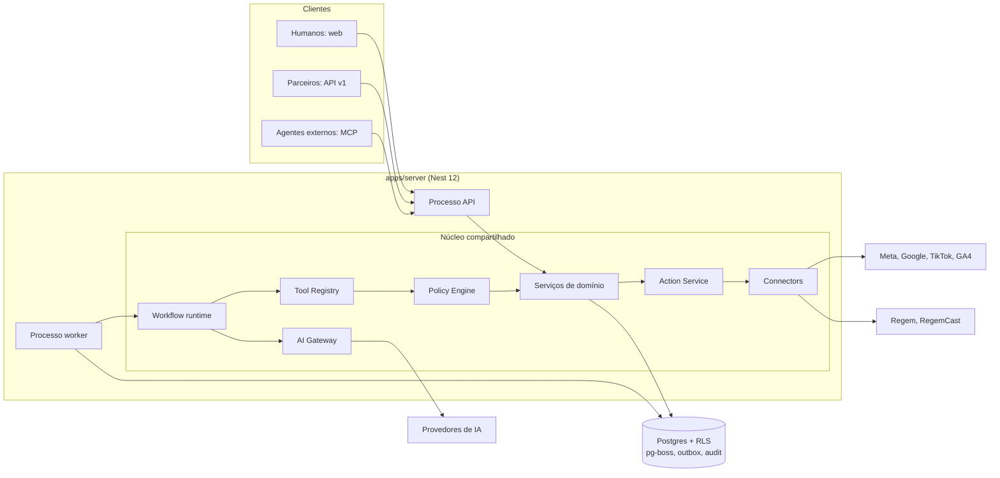

# Liame — Arquitetura consolidada

> Status: **aprovado pelo dono em 26/09/2026** (proposta de 24/09/2026). Regra: **preparado para crescer, mas não complexo antes da necessidade.**

## 1. Forma geral

**Monólito modular + workers + eventos**, num único Postgres (Supabase, São Paulo), com três contêineres no EasyPanel:

| Contêiner | O que roda | Origem |
| --- | --- | --- |
| `liame-web` | Next.js 16 (App Router), UI do cliente e do gestor | `apps/web` |
| `liame-api` | NestJS 12, processo **HTTP**: API `/v1`, webhooks de entrada, MCP adapter (A-fase B4) | `apps/server`, entrypoint `main.api.ts` |
| `liame-worker` | NestJS 12, processo **worker**: pg-boss, workflows, sync, connectors, motores de IA | `apps/server`, entrypoint `main.worker.ts` |

API e worker vêm da **mesma imagem** e compartilham os mesmos módulos de domínio. Cada processo liga só o que precisa (ADR-002).



## 2. O caminho de qualquer escrita externa

Humanos, API, automações, agentes internos e MCP usam **as mesmas regras de negócio**:

```text
Ator (humano | agente | integração | sistema | parceiro)
  → Tool (Tool Registry: schema, risco, escopos, impacto financeiro)
  → Policy Engine (determinístico; IA só assessora)
  → Serviço de domínio (regra de negócio)
  → Action Request (plan_id, hash, action_fingerprint)
  → Budget Engine (ledger: reserva)
  → Approval (se a política exigir; amarrada ao hash)
  → Action Service (idempotente, verifica kill switch e feature flag)
  → Connector (capability registry, circuit breaker, validate_only)
  → Provider externo
  → Audit (append-only, hash encadeado) + outbox (evento)
```

**Proibido:** agente → banco; agente → API externa; agente com token de plataforma; MCP como barramento interno.

## 3. Tool Registry

Registro versionado de toda ferramenta disponível a agentes internos, MCP, UI de administração, auditoria, Policy Engine e evals.

| Campo | Exemplo |
| --- | --- |
| `name` / `version` | `campanha_orcamento_ajustar` / `3` |
| `description` | texto para o modelo (revisado em PR) |
| `input_schema` / `output_schema` | derivados do schema Zod em `packages/contracts` |
| `risk_level` | R0 leitura · R1 escrita reversível · R2 irreversível ou mensagem a clientes · R3 financeira |
| `required_scopes` | `mtp:campanhas:escrever` |
| `side_effect` | `none` \| `internal` \| `external` |
| `requires_approval` | derivado da política, não fixo |
| `budget_impact` | `none` \| `increase` \| `decrease` \| `new_spend` |
| `idempotency` | `key` \| `fingerprint` \| `natural` |
| `timeout_ms` · `freshness_requirement` | `30000` · `metrics ≤ 6h` |
| `compensation_strategy` | `restore_previous_budget_if_unchanged` |
| `owner` · `provider` · `enabled` | `midia` · `meta` · flag |

**Agent Registry (catálogo de funcionários):** cada funcionário da agência é uma definição versionada que referencia ferramentas deste registro, políticas, modos de autonomia e rotas de modelo (`ai-architecture.md` §1). A ferramenta só é oferecida ao funcionário se a definição dele permitir **e** a política do tenant autorizar.

**No código (A3, I2):** as ferramentas de escrita (`actions/tools.ts`) e as de leitura dos funcionários de IA (`ai/registro/leituras.defs.ts`) formam um registro só, espelhado na tabela `tool_registry` com versão, risco, permissão exigida, descrição e formato dos parâmetros. A leitura (R0) só é oferecida a quem tem a permissão da rota equivalente e roda pelo mesmo serviço de domínio, na transação da empresa; o modelo recebe uma visão já formatada (datas no fuso da empresa, dinheiro em reais). Leituras dos números da marca: `fontes_frescor`, `atencao_avisos`, `resultados_ciclo_fechado`, `midia_entrega`, `cupons_campanha` e `links_rastreio`. E `equipe_trabalho` (04/10/2026), só da conversa com a LIA: o que a tela Sua equipe mostra, para quem tem as duas permissões da rota dela e é uma pessoa na sessão.

O OpenAPI (`x-mcp`) alimenta parte desses campos, mas **a fonte é o registro**. A exposição MCP é só um adapter por cima:

```text
                    Tool Registry
                   /             \
      agentes internos         MCP adapter (/mcp/liame)
             │                      │
      serviços de domínio     agentes externos
```

## 4. Workflows × agentes

**Fila não é workflow.** O pg-boss entrega jobs. O estado do workflow vive em tabelas próprias: `workflow_run`, `workflow_step`, `workflow_event`, `approval`, `tool_execution`, `action_execution`. Um workflow pode esperar aprovação por dias sem manter um job preso: o passo fica `waiting`, e a aprovação publica um evento que agenda a continuação.

| É workflow (passos fixos, IA opcional em um passo) | É agente (decide o caminho) |
| --- | --- |
| Sync de métricas; relatório semanal; detecção de anomalias; verificação de freshness; reconciliação de gasto; envio de régua aprovada; âncora diária da auditoria | Plano estratégico; pauta criativa; diagnóstico de queda fora do padrão; conversa aberta do Atendimento; montagem de plano multicanal |

Exemplo, o relatório semanal: `schedule → load → validar freshness → métricas determinísticas → anomalias → LLM resume → compliance → enviar`.

## 5. Eventos: outbox e inbox

- **Outbox:** a mutação de domínio e o `INSERT` no outbox acontecem na **mesma transação**. O worker publica depois (webhooks de saída, jobs, projeções). Evita "dado salvo, evento perdido".
- **Inbox (entrada):** todo webhook recebido segue `receber → verificar assinatura → persistir cru → deduplicar (external_event_id UNIQUE) → ACK → processar assíncrono`. Nada crítico roda antes de persistir (LIC-009).
- **Envelope:** CloudEvents 1.0 em eventos internos e webhooks de saída; catálogo em AsyncAPI 3.
- **Webhooks de saída:** Standard Webhooks (HMAC, `webhook-id`), retry exponencial, DLQ, reenvio manual.

## 6. Connectors e Capability Registry

Um connector por provider, com interface comum e capacidades declaradas:

```ts
interface Connector {
  provider: ProviderId;              // meta_ads, google_ads, tiktok_ads, ga4, regem, regemcast…
  capabilities(): Capability[];      // lidas do Capability Registry
  healthCheck(ctx): Promise<Health>;
  fetchAccounts(ctx) / fetchCampaigns(ctx) / fetchMetrics(ctx, window);
  // escrita só pelo Action Service:
  execute(ctx, action: ActionSpec, opts: { validateOnly: boolean }): Promise<ActionResult>;
  readState(ctx, ref): Promise<ProviderState>;   // para compensação e concorrência otimista
}
```

**Connector Capability Registry** (tabela versionada): `provider, api_version, capability, read, write, required_scope, access_level, deprecated_at, replacement, verified_at`. Exemplo: `google_ads · offline_conversion → provider = data_manager`. Contract tests com fixtures versionadas quebram o CI antes de quebrar a produção. O payload bruto fica guardado para reprocessamento.

Resiliência por provider: **circuit breaker** (para de insistir, enfileira, backoff, alerta), **token bucket por app × conta** e **escalonamento justo entre tenants**, porque as cotas das plataformas são do app e compartilhadas.

**Vigia de integrações (ADR-015):** funcionário da distribuição que lê, todo dia, as fontes oficiais de mudança (changelogs e páginas de versão, releases de SDKs e servidores MCP, cabeçalhos `Deprecation`/`Sunset` das respostas), cruza com o Capability Registry e agenda tarefas com data: na vigência, D+1 e D+7, e alertas 60, 30 e 7 dias antes de uma versão expirar. Propõe atualização da base de conhecimento e do registry; nunca muda código sozinho.

## 7. Contratos

- `packages/contracts`: schemas **Zod 4** (compatíveis com **Standard Schema**). Uma fonte alimenta validação na API, tipos no front, JSON Schema para ferramentas e structured output, eventos e MCP.
- **OpenAPI 3.1** gerado a partir desses schemas é o contrato público: Spectral (lint) + oasdiff (barra quebra) + SDK TypeScript gerado.
- `/v1`, RFC 9457, cursor, `Idempotency-Key`, cabeçalhos `RateLimit`, `Deprecation`/`Sunset`.
- **Nomes (26/09/2026):** rotas e campos JSON em **inglês** e `snake_case` (contrato para parceiros); textos para a pessoa (`title`, `detail`, mensagens), códigos de erro e as permissões em **português**, como nos ADRs.

## 8. Organização do código

Detalhe e justificativa no ADR-002.

```text
mtp-ia/
  apps/
    web/                      Next.js 16
    server/                   NestJS 12 — dois entrypoints: main.api.ts e main.worker.ts
      src/modules/
        auth/ tenants/ organizations/ brands/ units/ users/ permissions/
        integrations/ campaigns/ creatives/ audiences/ attribution/ orders/
        messaging/ reports/ approvals/ actions/ policies/ workflows/ audit/
        ai/ billing/ flags/ tools/ connectors/
        (cada módulo: domain/ application/ infrastructure/ http/ events/ — só as pastas que tiver)
  packages/
    contracts/                Zod + tipos + geração do OpenAPI e dos JSON Schemas
    database/                 schema Drizzle, migrations SQL, helpers de RLS e tenant context
    ui/                       design system (tokens semânticos + componentes)
    telemetry/                bootstrap OpenTelemetry comum (web e server)
    config/                   tsconfig, eslint, biome/prettier, variáveis tipadas
    testing/                  fábricas, fixtures de connectors, harness de RLS e cross-tenant
  evals/                      datasets versionados + runner (portão do CI)
  docs/                       especificação, arquitetura, ADRs
```

**Regra para criar pacote:** só quando **dois apps** precisarem do código. `ai`, `policy`, `connectors`, `workflows` e `actions` começam como **módulos** do `apps/server` e viram pacote no dia em que o hub MCP ou outro app precisar deles. Fronteiras entre módulos checadas por lint (dependency-cruiser ou eslint-plugin-boundaries): um módulo só importa a API pública (`index.ts`) de outro.

## 9. Infraestrutura inicial e limites

VPS Brasil (EasyPanel, Docker), Cloudflare na frente (WAF, TLS, limite grosso por IP e host), Supabase São Paulo. Os modelos de IA rodam fora, então a VPS aguenta o piloto.

**Limites de concorrência (config, desde a A1):** `api_concurrency`, `worker_concurrency`, `agent_concurrency`, `provider_concurrency` (por provider/app), `tenant_concurrency` (justiça entre clientes).

**Gatilhos objetivos de upgrade da VPS ou de réplicas** (medidos pelo OpenTelemetry):

| Métrica | Alerta | Ação |
| --- | --- | --- |
| CPU média 15 min | > 70% por 3 dias | aumentar a VPS ou separar o worker em outra VPS |
| Memória | > 80% | idem |
| Queue lag (p95 da espera do job) | > 5 min em fila crítica | mais réplicas de worker |
| HTTP p95 | > 800 ms | investigar; réplica de API |
| Conexões ao banco | > 70% do limite do pooler | revisar pool; plano do Supabase |
| AI p95 | > limite da tarefa no model routing | trocar rota ou modelo |

Nada de Kubernetes neste estágio.

## 10. Observabilidade (desde a A1)

OpenTelemetry com **um `trace_id` de ponta a ponta**: Next → API → workflow → worker → agente → ferramenta → política → ação → connector → provider. Traces, métricas e logs saem por OTLP para um backend trocável (escolha no ADR-010). Observabilidade de IA própria (provider, modelo, versão do prompt e da ferramenta, tokens, cache, custo, latência, tool calls, bloqueios de política, concordância humano/IA, regret) fica no **AI Usage Ledger** + traces com convenções `gen_ai.*`.

**Log operacional ≠ auditoria:** logs expiram; a auditoria tem retenção, integridade e âncora próprias.

## 11. Feature flags e kill switch

- **Flags** avaliadas por ambiente → plano → tenant → marca → conta → usuário (a mais específica vence). Nascem desligadas as de risco: `meta_write`, `google_write`, `autopilot`, `mcp_write`, `creative_generation`, `whatsapp_campaign`.
- **Kill switch** em níveis: global · provider (ex.: `provider=meta, write=true`) · tenant · marca · conta · ferramenta. Checado pelo Action Service **antes de toda execução**, com um job que pausa o que o agente criou quando acionado. Desligar escrita não derruba relatórios.

## 12. Resiliência de IA

O AI Gateway permite fallback entre provedores **só para modelos com eval aprovado na mesma tarefa**. Em ação financeira crítica, **nunca** há fallback silencioso para modelo não avaliado: a tarefa espera ou escala para humano. Com todos os provedores fora, o produto continua funcionando sem IA (especificação §5).

## 13. Integração com a MCP central da DMS

O hub (trilha B) é outro projeto. O Liame expõe `/mcp/liame` como **adapter do Tool Registry**, atrás do hub, com audience e escopos próprios. Continua valendo: sem estado, sem repassar o token do usuário, token interno de curtíssima duração, RBAC reaplicado no Liame, R2/R3 com planejar → aprovar → executar(`plan_id`) e alto risco aprovado fora do chat.

## 14. Tratamento de erros

Uma política só, do banco à tela.

| Tipo | Exemplos | HTTP | Repete sozinho? | O que o usuário vê |
| --- | --- | --- | --- | --- |
| Validação | campo faltando, valor fora da faixa | 400 / 422 | não | o campo errado e como corrigir |
| Autenticação | sessão vencida, segundo fator | 401 | não | "Entre de novo" |
| Permissão | falta permissão ou política | 403 | não | o que falta e quem pode liberar |
| Não encontrado | inclusive registro de outro tenant | 404 | não | "Não encontramos" (nunca "é de outra empresa") |
| Conflito | versão do plano mudou, edição concorrente | 409 / 412 | não | "Mudou enquanto você via; confira a versão nova" |
| Limite | cota nossa ou da plataforma | 429 | sim, após o `Retry-After` | "A Meta pediu uma pausa; tentamos de novo às 10:12" |
| Dependência externa | Meta, Google ou RegemCast fora ou lentos | 502 / 503 / 504 | sim, com recuo e circuit breaker | "A Meta não respondeu; nada foi alterado" |
| Interno | defeito nosso | 500 | não | "Algo deu errado do nosso lado" + código para o suporte |

- **Formato único:** RFC 9457 (`application/problem+json`) com `type` estável (ex.: `https://agencialiame.com/erros/orcamento-acima-do-limite`), `title` em pt-BR, `detail` sem dado interno, `code` estável e **`trace_id`** em toda resposta.
- **Log com o motivo:** erro esperado (validação, permissão, conflito) registra o motivo em nível informativo; 5xx sempre com stack, `trace_id` e tenant, e gera alerta. Nunca segredo, token ou dado pessoal no log.
- **Repetir só o que é transitório**, sempre com `Idempotency-Key`. O permanente vai para a fila de mortos (DLQ) com o motivo.
- **Erro de plataforma vira causa e ação:** cada código e subcódigo da Meta e cada falha do Google Ads é mapeado no connector para uma categoria nossa (token vencido → reconectar; política → Compliance; limite → reagendar).
- **Erro de agente:** ferramenta falhou → repete se for transitório; falhou de novo → o funcionário para, registra e chama um humano. O agente nunca inventa um resultado para cobrir o erro.
- **Escrita externa pela metade:** dispara a ação compensatória (ADR-007), e o aviso diz exatamente o que ficou feito e o que não.
- **Nas telas:** toda tela tem estado de erro desenhado (toast para ação, aviso no bloco para dado que não carregou, tela cheia só quando nada funciona), sempre com o que fazer a seguir.
